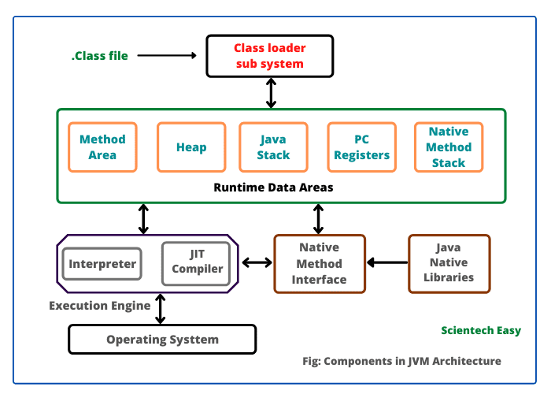

# **JVM->**
Java Virtual Machine (JVM) is an implementation of a virtual machine which executes a Java program.

The JVM first interprets the bytecode. It then stores the class information in the memory area. Finally, it executes the bytecode generated by the java compiler.

Components of the JVM are:

1. Class Loaders
2. Run-Time Data Areas
3. Execution Engine

*ClassLoaders->*
Load java classes dynamically to JVM during runtime. They’re also part of the JRE (Java Runtime Environment). Therefore, the JVM doesn’t need to know about the underlying files or file systems to run Java programs thanks to class loaders.

Furthermore, the JVM doesn’t load these Java classes into memory all at once, but rather when an application requires them. This is where class loaders come into the picture. They’re responsible for loading classes into memory.

A class loader has two main functions:

Load Classes – Different built-in and custom class loaders load classes. We can extend the java.lang.ClassLoader abstract class to create class loader implementations
Locate Resources – A resource is some data such as a .class file, configuration information, or an image. We typically package resources with an application or library so that they are easy to locate
At the outset, class loaders don’t create objects for array classes
When you write:
class User {}
The ClassLoader loads User.class file into JVM.
Every normal class has:
User.class.getClassLoader()
which returns something like:
AppClassLoader

When you write:
User[] users = new User[5];
System.out.println(users.getClass().getClassLoader());
There is NO User[].class file on disk.
It will return the same class loader that loaded User.

int[] arr = new int[5];
System.out.println(arr.getClass().getClassLoader());
int[] → element type = int → primitive → no class loader
This will return null as Primitive types (int, long, double) are NOT loaded by a class loader.
They are built-in to JVM.

The Java run-time supports three built-in class loaders:

Bootstrap class loader – The Bootstrap ClassLoader is the JVM’s built-in class loader.
It is implemented in native code (C/C++), not Java.
It loads core Java classes like:
java.lang.String
java.lang.Object
java.util.*
java.lang.*
These classes are part of the core Java runtime.
It loads classes from:<JAVA_HOME>/lib
In modern Java (9+), it loads from runtime modules (java.base).

Platform class loader – Before Java 9, this was called Extension ClassLoader.
After Java 9 modular system, it became Platform ClassLoader.
It loads:
Java SE platform APIs
JDK internal classes
Modules other than java.base
javax.sql.DataSource.class.getClassLoader()
This is usually loaded by Platform ClassLoader.

System class loader – Also known as application class loader, loads classes on the application class path, module path, and JDK-specific tools
It loads:
Classes from your application
Classes from your dependencies (Maven/Gradle jars)
Classes from classpath
Classes from module path
MySpringBootApp.class.getClassLoader()-> o/p-> jdk.internal.loader.ClassLoaders$AppClassLoader

Full Hierarchy->
Bootstrap ClassLoader
    (loads core java classes)
           ↑
Platform ClassLoader
    (loads platform modules)
           ↑
System / Application ClassLoader
    (loads your app + dependencies)

When JVM requests a class->
1. AppClassLoader checks if the class is already loaded
2. If not loaded , it passes the same to parent and that also passes the same to its parent based on hierarchy. 
3. If not found at the top, it comes back down and AppClassLoader loades it. Further it uses the virtual machine built-in class loader if the parent is null.

Delegation Model->
ClassLoaders follow this model where on being requested to find a class or resource, a classloader interface will delegate the search of the class or resource to the parent class loader. 

Unique class->
To ensure unique classes we always delegate upwards.

Visibility->
Child class loaders can see the classes loaded by the parent but the ooposite is not allowed.

Note->
1. Springboot uses custom classholders
2. if custom classholder is not garbage collected-> memory leak
3. Drivers(Ex. JDBC Drivers) loaded via ServiceLoader+System Class Loader

*Run-Time Data Areas->*
The JVM defines various memory areas to execute a Java program. These are used during runtime and are known as run-time data areas. Some of these areas are created on the JVM start-up and destroyed when the JVM exits while some are created when a thread is created and destroyed when a thread exits.

Method Area->
The Method Area is a special memory region inside the JVM that stores class-level information.
It is NOT for storing objects.
It stores metadata about classes.

For every class loaded by the JVM, the Method Area stores:
1. Fully Qualified Class Name
2. Field Information(Field name, data type, modifiers)
3. Method Information( method name, access modifier, parameter type, return type,bytecode of methods)
4. Constructors
5. Run time constant pool(String literals, Numeric constants,Symmbolic reference)
   
Method Area stores:
Class metadata + method bytecode
It does NOT store:
Object instances
Local variables

It is located inside JVM memory conceptually
for Java7 or below it was known as PermGen, after Java 8 it's now Metaspace
PermGen had fixed size, faced frequent outofmemory error
Metaspace uses native memory, not part of heap and grows dynamically by default.
The memory blocks for Method Area do not have to be one continuous chunk.
They can be allocated in pieces.
Unlike some older memory models that required continuous memory.

* Metaspace also faces OutOfMemory at times even after being dynamic and that doesn't mean your system emmory has exhausted, it means Metaspace has hit its limit. This uses native memory, not heap. If Heap + Metaspace + Threads + DirectBuffer + OS usage
exhaust total RAM, Metaspace won't be able to expand, but still heap may have space. Or may be JVM started with max Metaspace memory size. or class loader leakage may have happened.

Garbage collection happens here as well but unlike Heap it's for unloaded classes.
A class is unloaded if the below three are met:

1️⃣ The class has no live objects on heap
2️⃣ The class is not referenced anywhere
3️⃣ The ClassLoader that loaded it is garbage collected

Heap Area->
The JVM allocates the memory for all the class instances and arrays from this area.
Garbage Collector (GC) reclaims the heap memory for objects. Basically, GC has three phases to reclaim memory from objects viz. two minor GC and one major GC.
The heap memory has three portions:
Eden Space – it’s a part of Young Generation space. When we create an object, the JVM allocates memory from this space
Survivor Space – it’s also a part of Young Generation space. Survivor space contains existing objects which have survived the minor GC phases of GC
Tenured Space – this is also known as the Old Generation space. It holds long surviving objects. Basically, a threshold is set for Young Generation objects and when this threshold is met, these objects are moved to tenured space.
JVM creates heap area as soon as it starts up. All the threads of the JVM share this area. The memory for the heap area does not need to be contiguous.

Stack area ->
Stores data as frames and each frame stores local variables, partial results and nested method calls. JVM creates the stack area whenever it creates a new thread. This area is private for each thread.

ProgramCounter Registers->
Each JVM thread has a separate PC Register which stores the address of the currently executing instruction. If the currently executing instruction is a part of the native method then this value is undefined.

Native method stacks->
Native methods are those which are written in C/C++.JVM provides capabilities to call these native methods. Native method stacks are also known as “C stacks”. They store the native method information. Whenever the native methods are compiled into machine codes, they usually use a native method stack to keep track of their state.
The JVM creates these stacks whenever it creates a new thread. And thus JVM threads don’t share this area. As each thread has its own stacks and Threads do NOT share stack memory.

In Java, they are declared using native keyword.
public class Test {
    public native void doSomething();
}
Notice:
No method body
Implementation is in C/C++
Linked using JNI (Java Native Interface)

Why Do We Need Native Methods?
Java needs to interact with OS
Hardware access
File system
Networking
Performance-critical code
For example:
java.lang.Object#hashCode() internally calls native code.

Java methods use Java Stack
Objects use Heap
When a native method (C/C++) runs, it cannot use Java stack.
So JVM provides a separate stack called:
Native Method Stack (also called C stack)

*Execution Engine->*
Execution engine executes the instructions using information present in the memory areas.
It has three parts->
Interpreter->
Once classloaders load and verify bytecode, the interpreter executes the bytecode line by line. This execution is quite slow. The disadvantage of the interpreter is that when one method is called multiple times, every time new interpretation is required.
However, the JVM uses JIT Compiler to mitigate this disadvantage.
An interpreter:
Reads bytecode
Executes it line by line
Every single time the method runs
It does not convert it to native machine code permanently.
for(int i = 0; i < 1000000; i++) {
    printHello();
}

If JVM used only interpreter:
Every time printHello() is called:
It reads the bytecode instructions
Decodes them
Executes them
Repeats again next time
So the interpretation happens again and again.

JIT on the other hand detects frequently used methods (“hot methods”), converts them into native machine code and stores the compiler version.
but both are there in JVM as Interpreter helps in faster startup and JIT is there for high performance later.

Just-In-Time (JIT) Compiler->
JIT compiler compiles the bytecode of the often-called methods into native code at run-time. Hence it is responsible for the optimization of the Java programs.
JVM automatically monitors which methods are being executed. Once a method becomes eligible for JIT compilation, it is scheduled for compilation into machine code. This method is then known as a hot method. This compilation into machine code happens on a separate JVM thread.
As a result, it does not interrupt the execution of the current program. After compilation into machine code, it runs faster.

Garbage Collector->
Java takes care of memory management using Garbage Collection. It’s a process of looking at heap memory, identifying which objects are in use and which are not, and finally deleting unused objects.
GC is a daemon thread. It can be called explicitly using System.gc() method, however, it won’t be executed immediately and the JVM decides when to invoke GC.

What Is a Daemon Thread?
In Java, there are two types of threads:
1️⃣ User Thread
Normal thread
JVM waits for it to finish
Example: main thread

2️⃣ Daemon Thread
Background thread
JVM does NOT wait for it to finish
Automatically stops when all user threads finish

If main() finishes, JVM exits — even though this thread is still running.
Even though GC is daemon:
It can still pause your application (Stop-The-World pause)
It still consumes CPU
It still affects performance
Daemon does NOT mean “weak” or “low priority.”
It just means:
JVM does not wait for it during shutdown.

What Is Stop-The-World (STW)?
Stop-The-World pause means:
The JVM temporarily pauses ALL application threads so that Garbage Collection can safely run.

During this time:
Your application does nothing
No requests are processed
No business logic runs

Only GC thread works
🔹 Why Does JVM Stop Everything?

GC needs to:
Identify which objects are alive
Identify which objects are garbage
Move objects (in compacting collectors)
Update object references

If application threads kept modifying objects while GC is running:
👉 Memory would become inconsistent
👉 Objects might get deleted incorrectly

So JVM pauses all threads to ensure safety.
🔹 What Exactly Stops?
All user threads stop:
Main thread
Request handling threads
Executor threads
Scheduled jobs
GC threads continue running.

*Java Native Interface->* 
It acts as an interface between the Java code and the native (C/C++) libraries.
Java is platform independent but sometimes you need:
OS-specific features
Hardware access
High-performance native libraries
Existing C/C++ libraries
Device drivers
Java alone cannot do this directly So JNI helps.
Ex: System.currentTimeMillis();
JVM calls native OS function->Gets system time->Returns it to Java

*Native Libraries->*
These are platform specific libraries and contains the implementation of native methods.

