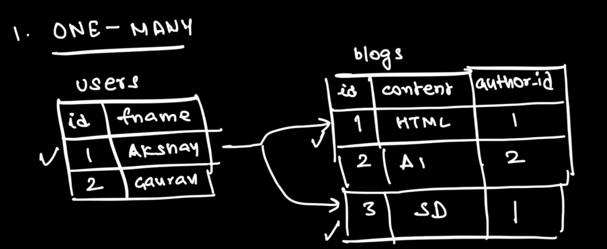
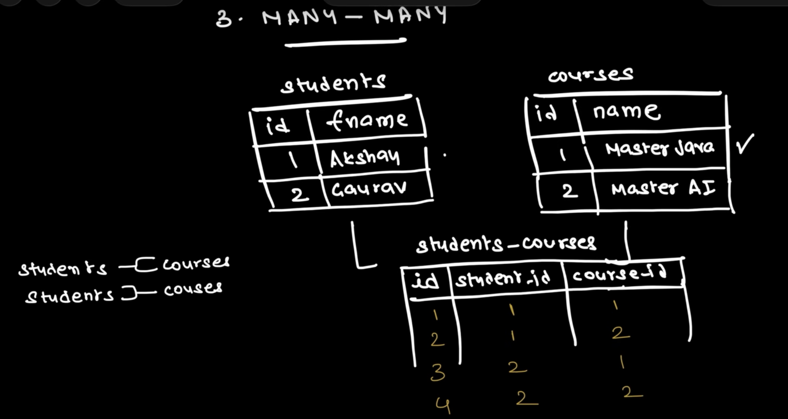

# DataBase->

## SQL (Structured Query Language)

SQL is a language used to interact with relational databases. It is used to create, read, update, and delete data (CRUD operations). 

*Key Features:*  

Data is stored in tables (rows and columns). 
Uses a fixed schema (structure is predefined). 
Supports relationships using primary keys and foreign keys. 
Follows ACID properties for reliable transactions. 

Examples of SQL databases: 

MySQL 
PostgreSQL 
Oracle Database 
Microsoft SQL Server 

### SQL Constraints->
1. Unique  
2. Not Null  
3. Primary Key  
4. Check (Used for Validation)  
5. Foreign Key  
6. Default (Null can't be the value) -> Suppose for Telusko every user is assigned the default role as learners.  

### JOINS->
1. One to Many -> Mapping between User and Blogs.  
  
2. Many to One -> Mapping between Blogs to User.  
3. Many to Many -> Mapping between Courses and Students.  
     

## NoSQL (Not Only SQL)

NoSQL databases are non-relational databases designed to handle large volumes of unstructured or semi-structured data. They provide flexible schemas and are well-suited for modern, scalable applications. 

Key Features: 

Flexible or schema-less data model. 
Can store data as documents, key-value pairs, graphs, or columns. 
Easily scalable for large datasets. 
High performance for distributed applications. 

Examples of NoSQL databases: 

MongoDB (Document) 
Redis (Key-Value) 
Cassandra (Column) 
Neo4j (Graph) 