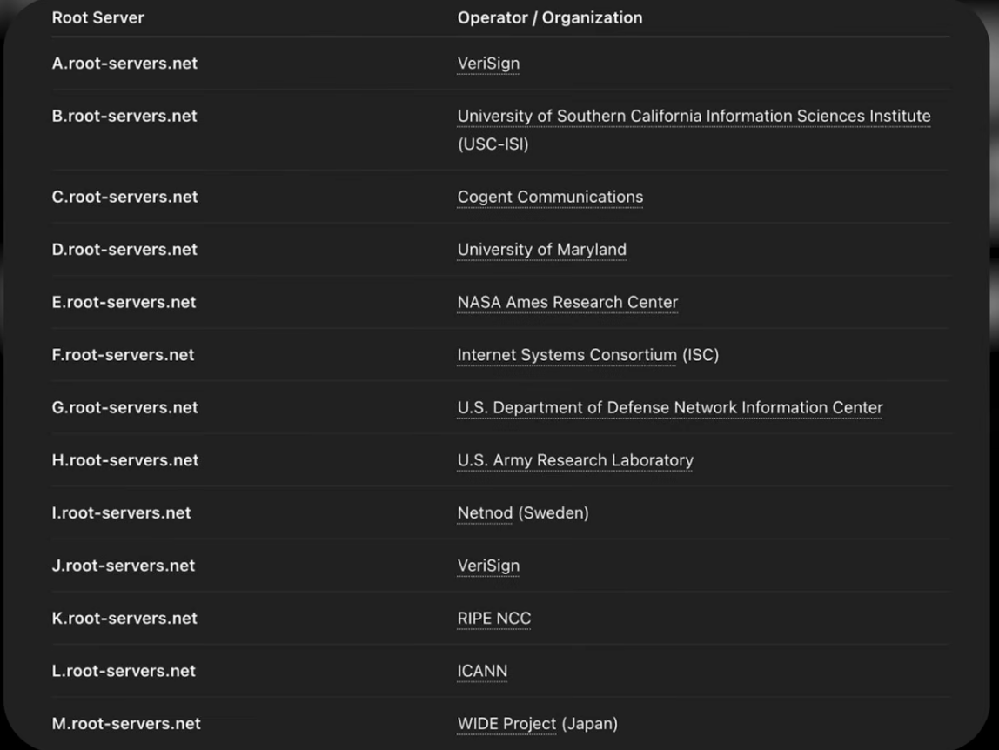
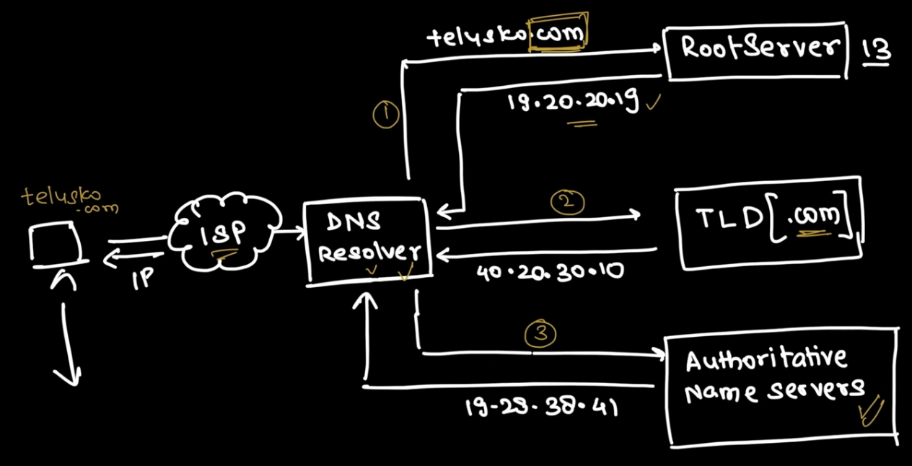

# Domain Name System

docs.telusko.com -> here telusko.com is the domain and docs is teh sub domain. <br>

## Why All The Domains Can't Be Stored In The Browser?
1. Currently we have around 350m Domains in the whole world, if everything needs to be stored in browser, that will make it heavy.<br>
2. If one website wants to move from one domain to another domain, as example GoDaddy to Google Doamins, then the ip can be changed. In thta case, we need to ensure all the browser where telusko.com is running got updated with new IP.<br>

This is why DNS came into the picture.

Suppose there is one machine, which is using Internet Service Provider and that Service Provider has DNS Resolver. DNS resolver is responsible to provide the correct IP for any website or domain which we are trying to process.<br>

## Root Servers
First call DNS going to make is to the **Root Server**. There are 13 root servers, which means there are 13 companies who are maintaining 13 web servers. They are not physically 13 but got categorized to 13. They are named from A to M and owned by different companies as below :



## Flow


```
User
  ↓
Web Browser
  ↓
Domain Name System Resolver
  (Internet Service Provider Resolver, Google Public Domain Name System,
   Cloudflare Domain Name System, etc.)
  ↓
Domain Name System Root Name Server
  ↓
Top-Level Domain Name Server
  (.com, .org, .net, .in, etc.)
  ↓
Authoritative Domain Name System Name Server
  ↓
Internet Protocol Address Returned
  ↓
Web Server or Load Balancer
  ↓
Hypertext Transfer Protocol Secure Request
  ↓
Website Application
  ↓
Website Response Sent Back to User
```


So, first the user will go to Internet Service Provider, then to DNS resolver. DNS resolver will send the request to Root Server. Root Server will provide the IP for TLD. Once the user reaches to TLD it will consider the domain and will give IP for Authoritative Name Server. Then the Authoritative Name Server will provide the IP for the actual URL. Once that will be hit, the user will get the expected webpage.<br>
Now, that is correct for first time, but from second time onwards, we should get the details in cache to reduce the response time.<br>

### Cache Type->
1. Browser cache<br>
2. OS Cache<br>
3. DNS Resolver Cache<br>
The below is the hierarchy. But the part to notice is , this hierarchy is maintained during fetch only, while saving, info is being cached in different levels<br>
Browser DNS Cache
      ↓ (miss)
Operating System DNS Cache
      ↓ (miss)
DNS Resolver Cache
      ↓ (miss)

### Zone
Now there is a concept of Zone in ANS(Authoritative Name Server), means where the sub domain details are also there. If we are searching for abc.com, then docs.abc.com, store.abc.com everyone's IP will be in same zone. But we need to keep in mind, still only the IP related to abc.com will get fetched if we ask for this. <br>
But if something like below is in the code then it will fetch both the IPs<br>
```
<script src="https://docs.abc.com/app.js"></script>

```

